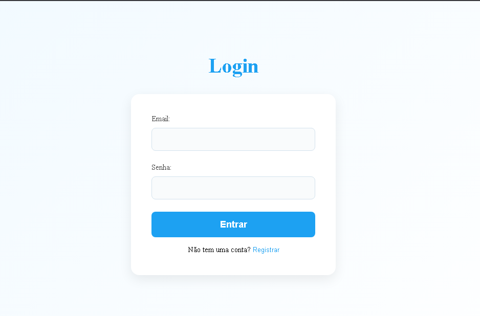
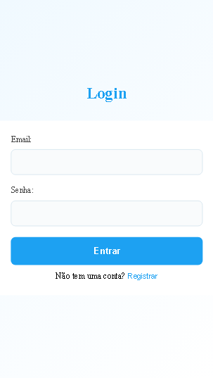
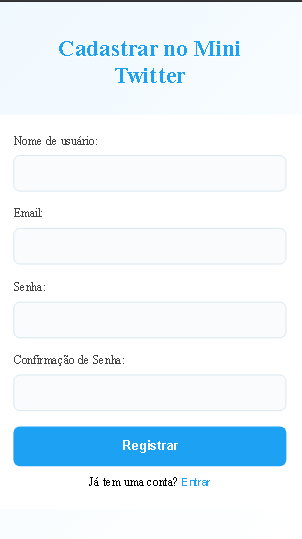
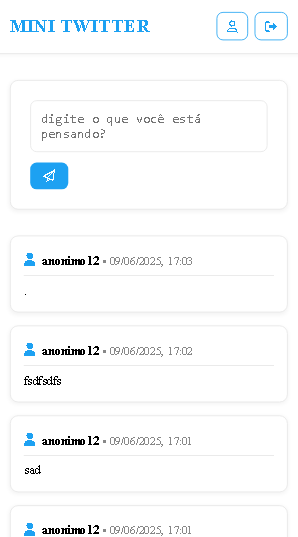

# 🚀 Mini Twitter – Projeto de Desenvolvimento Web

### 📌 Descrição

Este projeto é uma versão simplificada do Twitter, desenvolvida com **HTML**, **CSS** e **JavaScript puro** (sem uso de bibliotecas ou frameworks externos). O principal objetivo é praticar e demonstrar habilidades fundamentais em desenvolvimento web, criando uma aplicação onde os usuários podem fazer postagens curtas, similares aos tweets.

---

### 🛠️ Tecnologias Utilizadas

- **HTML5** semântico  
- **CSS3** com uso de Flexbox e/ou Grid  
- **JavaScript (ES6+)**  
- **Design responsivo** (abordagem *mobile-first*)  
- **Armazenamento local com `localStorage`**  

## 🖥️ Capturas de Tela 

Abaixo estão algumas telas da aplicação em funcionamento:

### Desktop
<p align="center">
  
  
  
</p>

### Mobile
<p align="center">
  
  
  
</p>

---

### ▶️ Como acessar o projeto

Você pode testar a aplicação acessando o link abaixo:

🔗 [Acessar Mini Twitter](https://theodorol.github.io/mini-twitter/)

---

### 🧑‍💻 Como rodar o projeto localmente

Se preferir, pode clonar este repositório e executar o projeto no seu computador:

1. **Clone o repositório:**

```bash
git clone https://github.com/theodorol/mini-twitter.git
```

2. **Entre na pasta do projeto:**

```bash
cd mini-twitter
```

3. **Abra o arquivo `index.html` no seu navegador** (duplo clique ou via extensão de servidor local, como o Live Server do VSCode).

---

### ⚠️ Aviso importante sobre abrir o projeto localmente

Se você abrir o arquivo `index.html` diretamente pelo sistema (ex: clicando duas vezes e abrindo via `file://`), pode aparecer um erro parecido com:

```
Access to script at 'file:///.../js/controllers/PostController.js' from origin 'null' has been blocked by CORS policy...
```

Isso acontece porque os navegadores bloqueiam requisições locais entre arquivos por segurança (*CORS*).

---

### 💡 Como evitar o erro CORS

A melhor forma de rodar o projeto é usando um **servidor local** para servir os arquivos via HTTP, como por exemplo:

- **VSCode + Live Server:** Instale a extensão Live Server, abra a pasta e clique com o botão direito no `index.html` > "Open with Live Server".

- **Python 3:** Na pasta do projeto, execute no terminal:

  ```bash
  python -m http.server 8000
  ```

  Depois acesse `http://localhost:8000` no navegador.

- **Node.js (serve):** Instale o pacote `serve` globalmente:

  ```bash
  npm install -g serve
  ```

  Depois execute:

  ```bash
  serve .
  ```

---

### 🤝 Contribuindo

Contribuições são bem-vindas! Se quiser sugerir melhorias ou corrigir bugs, siga estes passos:

1. Faça um fork deste repositório  
2. Crie uma branch para sua feature ou correção (`git checkout -b minha-feature`)  
3. Faça commit das suas alterações (`git commit -m 'Minha contribuição'`)  
4. Envie para o seu fork (`git push origin minha-feature`)  
5. Abra um pull request aqui no repositório original

---
